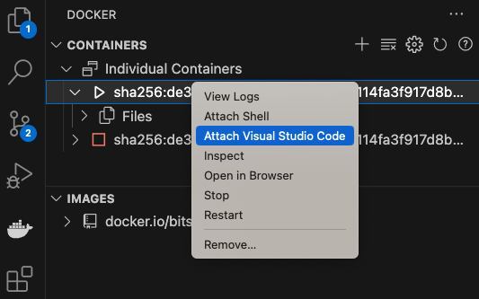

[](https://hub.docker.com/u/bitsrc)    
# Docker Image for Bit Application Development

## Getting Started

1. Install [Docker Desktop](https://www.docker.com/products/docker-desktop/).

2. Install [VSCode Docker Extension](https://marketplace.visualstudio.com/items?itemName=ms-azuretools.vscode-docker).

3. Install [VSCode Dev Containers Extension](https://marketplace.visualstudio.com/items?itemName=ms-vscode-remote.remote-containers).

## Using the Image

Pull the Docker Image (e.g For bit version 0.1.48) using CLI or VSCode extension.

> `docker pull bitsrc/dev:0.1.48`

Start the container and attach to it from VSCode (via Docker extension).



For more information on best practices:

- [Developing inside a Contaienr](https://code.visualstudio.com/docs/devcontainers/containers)

# Contributor Guide
If you plan to push a new image to Docker Hub, you can follow the below steps.

1. Build the docker image locally

```sh
docker buildx build --platform linux/amd64,linux/arm64 --build-arg BIT_VERSION=0.1.52 -t bitsrc/dev:0.1.52 . --push
```

## NODE_HEAP_SIZE (Optional, Default 4096)

You can specify a custom heap size for the image.

- 4096 (default)
- 8192

```
docker buildx build --platform linux/amd64,linux/arm64 --build-arg BIT_VERSION=0.1.52 --build-arg NODE_HEAP_SIZE=8192 -t bitsrc/dev:0.1.52m . --push
```

**Note:** For image naming convensions, use the suffix `m` added to the version for heap size 8192.

2. Push the docker image to Docker Hub

```
docker buildx build --platform linux/amd64,linux/arm64 --build-arg BIT_VERSION=0.1.52 --build-arg NODE_HEAP_SIZE=8192 -t bitsrc/dev:0.1.52m . --push
```