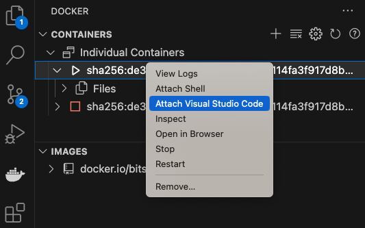

[](https://hub.docker.com/u/bitsrc) [](https://hub.docker.com/layers/bitsrc/stable/latest/images/sha256-e0f1fe5332e633b382185b08c17d0e3a7db898ec648f79eaa9bfa40caa663ce0?context=explore) [](https://hub.docker.com/layers/bitsrc/nightly/latest/images/sha256-e0f1fe5332e633b382185b08c17d0e3a7db898ec648f79eaa9bfa40caa663ce0?context=explore)
# Docker Images for Bit DevOps

## Getting Started

1. Install [Docker Desktop](https://www.docker.com/products/docker-desktop/).

2. Install [VSCode Docker Extension](https://marketplace.visualstudio.com/items?itemName=ms-azuretools.vscode-docker).

3. Install [VSCode Dev Containers Extension](https://marketplace.visualstudio.com/items?itemName=ms-vscode-remote.remote-containers).

## Using the Docker Image

Pull the Docker Image.

> `docker pull bitsrc/stable:latest`

> `docker pull bitsrc/nightly:latest`


Start the container and attach to it from VSCode (via Docker extension).



For more information on best practices:

- [Developing inside a Container](https://code.visualstudio.com/docs/devcontainers/containers)

For more information on best practices:

- [Developing inside a Container](https://code.visualstudio.com/docs/devcontainers/containers)

## Using with CI/CD

### Github Actions

```
# @file github-action.yml

name: Build

on:
  workflow_dispatch:

jobs:
  build:
    runs-on: ubuntu-latest
    container:
      image: bitsrc/stable:latest
    env:
      HOME: /home/bituser
    steps:
      - name: Initialize a workspace
        run: |
          bit -v
        displayName: 'Initialize a workspace'
```

### Azure DevOps Pipelines

```
# @file azure-pipelines.yml

trigger: none

pr: none

jobs:
- job: build
  displayName: Build
  pool:
    vmImage: 'ubuntu-latest'
  container:
    image: bitsrc/stable:latest
  steps:
  - script: |
      bit -v
    displayName: 'Check bit version'
```

### GitLab CI/CD

```
GitLab CI/CD

# @file .gitlab-ci.yml

image: bitsrc/stable:latest
  
build-job:
  stage: build
  script: 
    - |
      echo "bit version: $(bit -v)"
```

An addition to the pre-installed latest docker version, there are dedicated scripts supporting GitLab in the docker image.
- `gitlab.bit.init`
- `gitlab.bit.verify`
- `gitlab.bit.commit-bitmap`
- `gitlab.bit.merge-request`
- `gitlab.bit.tag-export`
- `gitlab.bit.branch-lane`
- `gitlab.bit.dependency-update`

You can use them as follows in your GitLab pipeline e.g:

```
GitLab CI/CD Using Scripts

# @file .gitlab-ci.yml

image: bitsrc/nightly:latest

variables:
  BIT_CLOUD_ACCESS_TOKEN: "bit_cloud_access_token"
  GIT_USER_NAME: “git_user_name”
  GIT_USER_EMAIL: “git”_user_email

build-job:
  stage: build
  script: 
    - |      
      gitlab.bit.init
      gitlab.bit.verify
  rules:
     - if: '$CI_PIPELINE_SOURCE == "push" && $CI_COMMIT_BRANCH == "main"'
```

## Utility Scripts
There is a collection of bit utility scripts available in the container.

### CheckServer
`checkserver` command, let's you test `bit start` and `bit run <app-name>` commands

```
checkserver <your-server-url> 
```

You can optionally specifiy the **maximum timeout** and **check frequency**. e.g:

```
cd my-workspace
bit start &
checkserver http://localhost:3000 600 5 # maximum timeout: 600 seconds, check frequency: 5 seconds
```

**Note:** You have to use '&' to run the dev server in the background, before executing `checkserver` command.

### BareScope
`barescope` command let's you create Bare Scope in your CI environment.

```
barescope <scope-name> <workspace-directory>
```

Here, it will create the barescope and update the remote in the given workspace directory. e.g:

```
barescope my-scope my-workspace
cd my-workspace
bit scope rename org.scope-name my-scope --refactor
bit link
bit compile
bit tag --message "CI tag"
bit export
```

### EngineStrict
`enginestrict` command let's you to install the bit engine version defined in the workspace.jsonc

```
"teambit.harmony/bit": {
  "engine": "0.2.3",
  "engineStrict": false // warning or error if the version of the engine is not the same as the workspace
},
```

**Note:** Use `bvm list --remote` to list available bit versions.

# Contributor Guide
If you plan to push a new image to Docker Hub, you can follow the below steps.

Build the docker image locally and publish

```sh
docker buildx build --platform linux/amd64,linux/arm64 -t bitsrc/stable:latest . --push
```

**Note:** To run the build image locally, use a single platform (either `linuxamd64, linux/arm64`) and use `--load` parameter replacing `--push`

## NODE_HEAP_SIZE (Optional, Default 4096)

Specify a custom heap size for the image.

- 4096 (default)
- 8192

```
docker buildx build --platform linux/amd64,linux/arm64 --build-arg NIGHTLY=true --build-arg NODE_HEAP_SIZE=8192 -t bitsrc/stable:latest . --push
```

## Using GitHub Action

You can use the GitHub Action specified in this repository to release never versions of the image.
